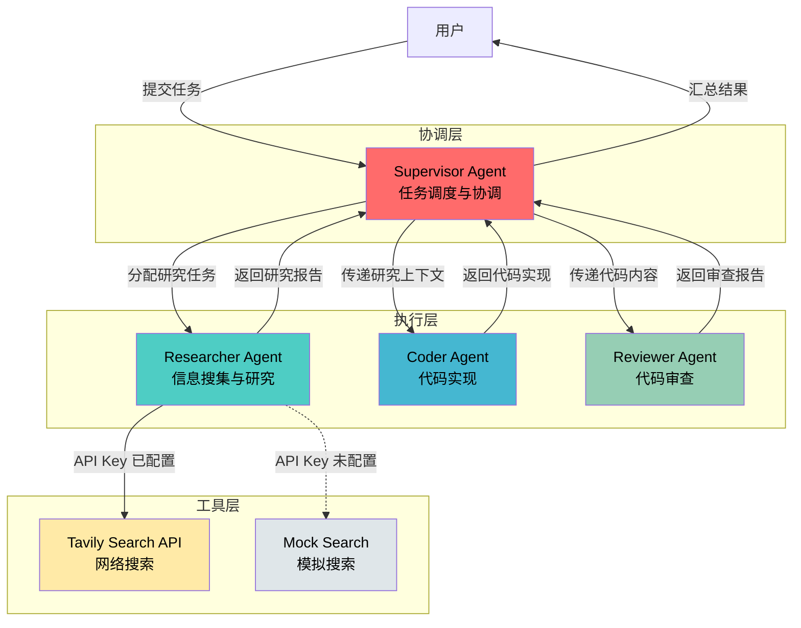
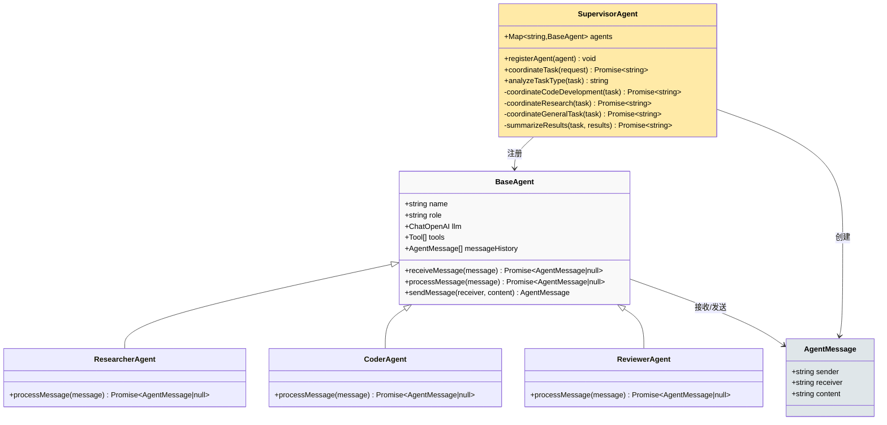
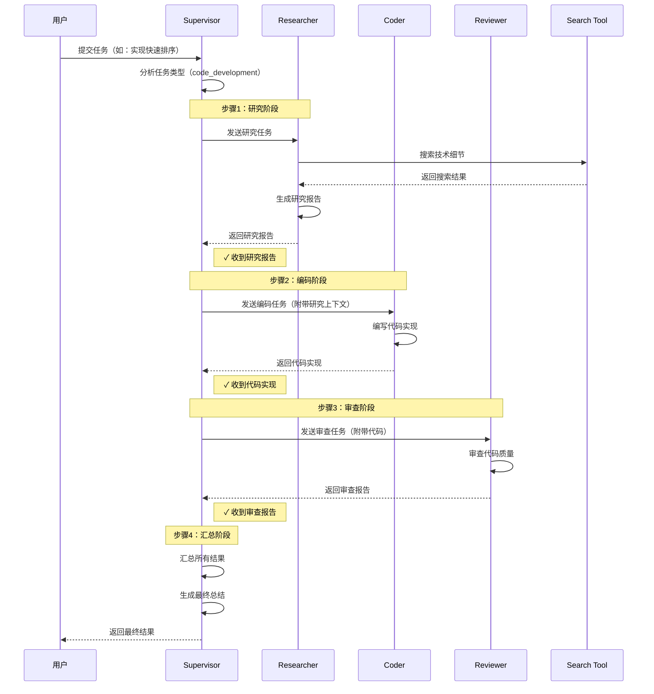
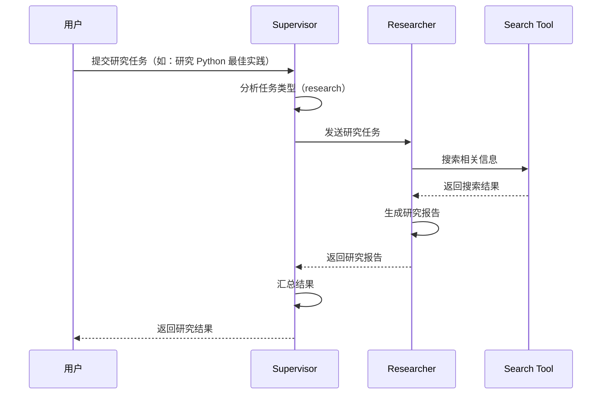
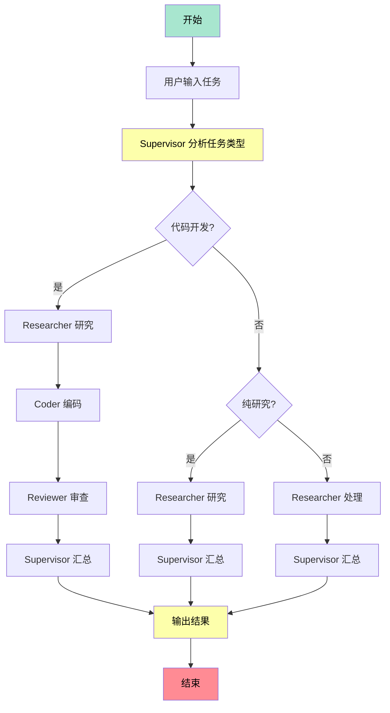

# 09 - 多智能体协作系统设计文档

## 📌 设计概述

多智能体协作系统是一种基于 Agent 的分布式问题解决框架，通过多个专业化 Agent 协同工作，完成复杂任务。本示例实现了一个 Supervisor 模式的多智能体系统，包含 Researcher（研究）、Coder（编码）、Reviewer（审查）三个专业 Agent。

### 核心特性

- **智能搜索集成**：支持 Tavily API 真实网络搜索，自动降级到模拟搜索
- **灵活的任务调度**：基于关键词自动识别任务类型，选择合适的协作流程
- **清晰的输出展示**：每个 Agent 的输出都有清晰的分隔线和标识
- **可扩展架构**：易于添加新的 Agent 类型和工具

---

## 🎯 核心设计目标

### 1. 任务分解与协作
- 将复杂任务分解为子任务
- 不同 Agent 专注不同领域
- 通过消息传递实现协作
- 支持串行和并行执行模式

### 2. 角色专业化
- **Researcher**：信息搜集、技术研究、知识总结
- **Coder**：代码实现、功能开发、性能优化
- **Reviewer**：代码审查、质量检查、问题识别

### 3. 统一协调机制
- Supervisor 统一调度
- 消息队列管理
- 结果汇总与总结
- 任务类型自动识别

### 4. 智能搜索能力
- 集成 Tavily API 真实网络搜索
- 自动降级到模拟搜索
- AI 驱动的搜索结果摘要
- 多源信息聚合

---

## 🏗️ 系统架构

### 整体架构图



### 类关系图



---

## 🔄 协作流程

### 代码开发任务流程



### 纯研究任务流程



---

## 🧩 核心组件

### 1. BaseAgent（基础 Agent 抽象类）

**职责**：定义 Agent 的通用行为和属性

**核心方法**：
```typescript
class BaseAgent {
  // 接收消息并处理
  async receiveMessage(message: AgentMessage): Promise<AgentMessage | null>

  // 处理消息（子类必须实现）
  async processMessage(message: AgentMessage): Promise<AgentMessage | null>

  // 发送消息
  sendMessage(receiver: string, content: string): AgentMessage
}
```

**设计模式**：模板方法模式

---

### 2. ResearcherAgent（研究 Agent）

**职责**：信息搜集、技术研究、知识总结

**工作流程**：
1. 接收研究任务
2. 使用搜索工具查询相关信息
3. 基于搜索结果生成研究报告
4. 返回研究报告给 Supervisor

**Prompt 设计**：
```
你是一个专业的研究助手，擅长：
1. 搜集和分析信息
2. 研究技术文档
3. 总结关键发现
4. 提供深入见解

任务：{task}
搜索结果：{searchResult}

请提供详细的研究报告，包括：
1. 核心概念
2. 关键技术点
3. 最佳实践
4. 注意事项
```

---

### 3. CoderAgent（编码 Agent）

**职责**：代码实现、功能开发、代码优化

**工作流程**：
1. 接收编码任务（可能包含研究上下文）
2. 编写高质量代码
3. 添加注释和文档
4. 返回代码实现

**Prompt 设计**：
```
你是一个专业的程序员，擅长：
1. 编写高质量的代码
2. 遵循最佳实践
3. 添加清晰的注释
4. 优化代码性能

任务：{task}

请提供：
1. 完整的代码实现
2. 代码注释说明
3. 使用示例
```

---

### 4. ReviewerAgent（审查 Agent）

**职责**：代码审查、质量检查、问题识别

**工作流程**：
1. 接收代码内容
2. 进行全面审查
3. 识别潜在问题
4. 提供改进建议

**Prompt 设计**：
```
你是一个专业的代码审查员，擅长：
1. 检查代码质量
2. 识别潜在问题
3. 提供改进建议
4. 评估代码性能

请审查以下内容：
{codeContent}

审查要点：
1. 代码正确性
2. 代码风格
3. 性能优化
4. 错误处理
5. 最佳实践
```

---

### 5. SupervisorAgent（协调 Agent）

**职责**：任务调度、Agent 协调、结果汇总

**核心功能**：

#### 5.1 Agent 注册
```typescript
registerAgent(agent: BaseAgent): void
```
- 将 Agent 注册到系统
- 维护 Agent 映射表

#### 5.2 任务类型分析
```typescript
private analyzeTaskType(task: string): string
```
- 基于关键词识别任务类型
- 支持三种类型：`code_development`、`research`、`general`

#### 5.3 任务协调
```typescript
async coordinateTask(userRequest: string): Promise<string>
```
- 根据任务类型选择协调策略
- 调用子 Agent 完成任务
- 汇总结果并返回

#### 5.4 结果汇总
```typescript
private async summarizeResults(task: string, results: string[]): Promise<string>
```
- 汇总所有 Agent 的输出
- 生成最终报告
- 提供任务完成情况和建议

---

## 📨 消息传递机制

### 消息结构

```typescript
interface AgentMessage {
  sender: string;      // 发送者 Agent 名称
  receiver: string;    // 接收者 Agent 名称
  content: string;     // 消息内容
}
```

### 消息流向

```
Supervisor → Researcher: "研究如何实现快速排序"
Researcher → Supervisor: "研究报告：..."

Supervisor → Coder: "根据研究报告编写代码..."
Coder → Supervisor: "代码实现：..."

Supervisor → Reviewer: "审查代码"
Reviewer → Supervisor: "审查报告：..."
```

### 消息历史

每个 Agent 维护自己的消息历史：
```typescript
messageHistory: AgentMessage[] = []
```

用于：
- 上下文追踪
- 调试和日志
- 未来扩展（如多轮对话）

---

## 🛠️ 工具系统

### Search Tool（搜索工具）

**实现**：模拟知识库搜索

**功能**：
```typescript
tool(
  async (input: { query: string }) => {
    const knowledgeBase: Record<string, string> = {
      "快速排序": "快速排序是一种分治算法...",
      "Python": "Python 是一种高级编程语言...",
      // ...
    };

    // 查找匹配的知识
    for (const [key, value] of Object.entries(knowledgeBase)) {
      if (input.query.includes(key)) {
        return `找到：${value}`;
      }
    }

    return `关于 '${input.query}' 的搜索结果：建议查阅官方文档和技术博客。`;
  },
  {
    name: "search_database",
    description: "搜索工具（模拟）",
    schema: z.object({
      query: z.string().describe("搜索查询"),
    }),
  }
)
```

**扩展性**：
- 可替换为真实搜索引擎（Tavily、Google Search）
- 可连接向量数据库（Chroma、FAISS）
- 可添加更多工具（计算器、文件读写等）

---

### Tavily 搜索集成

本示例已集成 Tavily 搜索 API，提供真实的网络搜索能力。

#### 配置方式

1. **获取 API Key**
   - 访问 https://www.tavily.com/ 注册账号
   - 获取免费 API Key（每月 1,000 次调用）

2. **配置环境变量**
   ```bash
   # 在 .env 文件中添加
   TAVILY_API_KEY=your_tavily_api_key_here
   ```

3. **自动选择搜索工具**
   ```typescript
   import { createSearchTool } from "./clients/tavily";

   // 自动检测 API Key，选择真实搜索或模拟搜索
   const searchTool = createSearchTool();
   ```

#### Tavily 搜索工具实现

```typescript
export function createTavilySearchTool(apiKey: string): Tool {
  return tool(
    async (input: { query: string }) => {
      const response = await fetch("https://api.tavily.com/search", {
        method: "POST",
        headers: { "Content-Type": "application/json" },
        body: JSON.stringify({
          api_key: apiKey,
          query: input.query,
          search_depth: "basic",
          max_results: 5,
          include_answer: true,
        }),
      });

      const data = await response.json();

      // 格式化搜索结果
      const searchResults = data.results
        .map((result, index) =>
          `${index + 1}. ${result.title}\n   URL: ${result.url}\n   内容: ${result.content.slice(0, 300)}...`
        )
        .join("\n\n");

      return `搜索结果：\n\n${searchResults}\n\nAI 总结：${data.answer || "无总结"}`;
    },
    {
      name: "tavily_search",
      description: "使用 Tavily API 进行网络搜索，获取最新的信息和技术资料",
      schema: z.object({
        query: z.string().describe("搜索查询关键词"),
      }),
    }
  ) as unknown as Tool;
}
```

#### 搜索工具选择逻辑

```typescript
export function createSearchTool(): Tool {
  const tavilyApiKey = process.env.TAVILY_API_KEY;

  if (
    tavilyApiKey &&
    tavilyApiKey !== "your_tavily_api_key_here" &&
    tavilyApiKey.length > 10
  ) {
    console.log("✓ 使用 Tavily 搜索 API");
    return createTavilySearchTool(tavilyApiKey);
  } else {
    console.log("⚠ Tavily API Key 未配置，使用模拟搜索工具");
    return createMockSearchTool();
  }
}
```

#### 使用示例

```typescript
// 在 main 函数中
const searchTool = createSearchTool();

// 注册 Researcher Agent
supervisor.registerAgent(new ResearcherAgent(llm, searchTool));

// 执行任务
await supervisor.coordinateTask("研究 TypeScript 的最新特性");
```

#### 优势

1. **实时信息**：获取最新的技术资料和文档
2. **AI 总结**：Tavily 提供智能摘要，减少 LLM 处理负担
3. **多源数据**：从多个网站聚合信息
4. **降级策略**：API Key 未配置时自动使用模拟搜索

---

## 🎯 任务类型与协调策略

### 1. Code Development（代码开发）

**触发关键词**：实现、编写、代码、函数、算法、程序

**协调流程**：
```
Researcher → Coder → Reviewer → Supervisor
```

**适用场景**：需要从研究到编码再到审查的完整流程

---

### 2. Research（纯研究）

**触发关键词**：研究、分析、比较、调研、技术

**协调流程**：
```
Researcher → Supervisor
```

**适用场景**：只需要信息搜集和分析

---

### 3. General（通用任务）

**默认流程**：
```
Researcher → Supervisor
```

**适用场景**：无法明确分类的任务

---

## 🚀 执行流程图



---

## 💡 设计优势

### 1. 模块化设计
- 每个 Agent 独立、可复用
- 易于添加新的 Agent 类型
- 支持灵活的组合

### 2. 职责分离
- Supervisor 专注协调
- 各 Agent 专注专业领域
- 清晰的责任边界

### 3. 可扩展性
- 新增 Agent：继承 BaseAgent
- 新增工具：注册到对应 Agent
- 新增任务类型：扩展协调策略

### 4. 可观测性
- 详细的日志输出
- 消息历史追踪
- 清晰的执行流程

---

## 🔧 扩展方向

### 1. 增加更多 Agent
- **TesterAgent**：自动化测试、测试用例生成
- **DocumenterAgent**：文档生成、API 文档编写
- **DeployerAgent**：部署自动化、CI/CD 集成
- **OptimizerAgent**：性能优化、代码重构
- **DebuggerAgent**：调试支持、问题诊断
- **ArchitectAgent**：架构设计、技术选型

### 2. 增强工具能力
- ✅ 集成真实搜索引擎（Tavily API）- 已完成
- 连接代码仓库（GitHub API、GitLab API）
- 添加 CI/CD 工具集成（Jenkins、GitHub Actions）
- 集成向量数据库（Chroma、FAISS、Pinecone）
- 添加文件操作工具（读写、解析、转换）

### 3. 改进协调策略
- 并行执行（某些 Agent 可同时工作）
- 动态任务分配（根据负载调整）
- 自适应流程（根据结果调整下一步）
- 任务优先级管理
- 失败重试机制

### 4. 增强状态管理
- 持久化任务状态
- 支持任务暂停/恢复
- 多用户并发支持
- 任务历史记录
- 进度追踪

### 5. 引入 LangGraph
- 使用状态图替代手动协调
- 可视化工作流
- 更强大的编排能力
- 支持循环和条件分支

### 6. 性能优化
- 结果缓存机制
- 批量处理支持
- 流式输出优化
- 异步任务队列
- 资源限制和配额管理

---

## 📝 使用示例

### 基本使用

```typescript
// 创建 LLM
const llm = createModelClient();

// 创建搜索工具（自动选择 Tavily 或模拟搜索）
const searchTool = createSearchTool();

// 创建 Supervisor
const supervisor = new SupervisorAgent(llm);

// 注册 Agent
supervisor.registerAgent(new ResearcherAgent(llm, searchTool));
supervisor.registerAgent(new CoderAgent(llm));
supervisor.registerAgent(new ReviewerAgent(llm));

// 执行任务
const result = await supervisor.coordinateTask("实现一个快速排序算法");
console.log(result);
```

### 使用 Tavily 搜索

```typescript
// 配置环境变量
// TAVILY_API_KEY=your_tavily_api_key_here

// 自动使用 Tavily 搜索
const searchTool = createSearchTool();

// 执行任务（将使用真实网络搜索）
const result = await supervisor.coordinateTask("研究 TypeScript 5.4 的新特性");
```

### 自定义 Agent

```typescript
class TesterAgent extends BaseAgent {
  constructor(llm: ChatOpenAI) {
    super("Tester", "自动化测试专家", llm);
  }

  async processMessage(message: AgentMessage): Promise<AgentMessage | null> {
    const code = message.content;

    // 编写测试用例
    const testPrompt = `为以下代码编写测试用例：\n${code}`;
    const response = await this.llm.invoke(testPrompt);

    return this.sendMessage("Supervisor", `测试代码：\n${response.content}`);
  }
}

// 注册自定义 Agent
supervisor.registerAgent(new TesterAgent(llm));
```

---

## 🐛 常见问题

### 1. Agent 之间没有协作

**原因**：消息 receiver 设置错误

**解决**：确保 receiver 是 "Supervisor" 或其他 Agent 的正确名称

```typescript
// ❌ 错误
const message = researcher.sendMessage("Researcher", task);

// ✅ 正确
const message = researcher.sendMessage("Supervisor", task);
```

---

### 2. 代码输出不完整

**原因**：LLM token 限制

**解决**：
- 使用流式输出
- 分段生成
- 限制输出长度
- 要求 LLM 分步骤输出

```typescript
// 优化 Prompt
const codingPrompt = `请分步骤完成以下任务：
1. 先输出完整的代码框架
2. 然后补充每个函数的实现
3. 最后添加注释和示例

任务：${task}`;
```

---

### 3. 审查报告不准确

**原因**：代码内容截断或格式错误

**解决**：
- 检查消息传递完整性
- 优化 Prompt
- 添加代码格式化
- 限制传递给 Reviewer 的代码长度

```typescript
// 限制代码长度
const codePreview = codeContent.length > 5000
  ? codeContent.slice(0, 5000) + "\n\n... (代码已截断)"
  : codeContent;
```

---

### 4. Tavily 搜索失败

**原因**：API Key 未配置或无效

**解决**：
- 检查环境变量 `TAVILY_API_KEY`
- 验证 API Key 是否有效
- 检查网络连接
- 查看错误日志

```bash
# 检查环境变量
echo $TAVILY_API_KEY

# 测试 API Key
curl -X POST https://api.tavily.com/search \
  -H "Content-Type: application/json" \
  -d '{"api_key": "your_key", "query": "test"}'
```

---

### 5. 任务执行缓慢

**原因**：多个 Agent 串行执行，每个都需要 LLM 调用

**解决**：
- 并行执行无依赖的 Agent
- 使用更快的模型
- 添加结果缓存
- 优化 Prompt 长度

```typescript
// 并行执行示例
const [researchResult, codeResult] = await Promise.all([
  researcherAgent.processMessage(researchMessage),
  coderAgent.processMessage(codeMessage)
]);
```

---

### 6. 消息历史过大

**原因**：长时间运行导致消息历史累积

**解决**：
- 限制消息历史长度
- 定期清理旧消息
- 使用滑动窗口
- 只保留关键消息

```typescript
// 限制消息历史
if (this.messageHistory.length > 100) {
  this.messageHistory = this.messageHistory.slice(-50);
}
```

---

## 📚 相关资源

- **LangChain Agents**: https://docs.langchain.com/docs/modules/agents/
- **Multi-Agent Systems**: https://en.wikipedia.org/wiki/Multi-agent_system
- **Supervisor Pattern**: https://refactoring.guru/design-patterns/mediator

---

## 🎓 学习要点

### 理解
1. 多智能体系统的协作模式
2. Supervisor 的协调机制
3. 消息传递的设计

### 掌握
1. 自定义 Agent 的开发
2. 工具的集成方式
3. 任务流程的编排

### 实践
1. 添加新的 Agent 类型
2. 实现新的工具
3. 优化协调策略

---

## 📊 性能考虑

### 时间复杂度
- 单个 Agent 调用：O(1) ~ O(n)（取决于 LLM 响应）
- 串行执行：O(k × n)（k = Agent 数量）
- 并行执行：O(n)（理想情况）

### 优化建议

#### 1. 并行化执行
```typescript
// 无依赖的 Agent 可并行执行
const [researchResult, analysisResult] = await Promise.all([
  researcherAgent.processMessage(task1),
  analystAgent.processMessage(task2)
]);
```

#### 2. 结果缓存
```typescript
const cache = new Map<string, string>();

async function cachedAgentCall(agent: BaseAgent, task: string) {
  const cacheKey = `${agent.name}:${task}`;
  if (cache.has(cacheKey)) {
    return cache.get(cacheKey);
  }

  const result = await agent.processMessage({ sender: "Supervisor", receiver: agent.name, content: task });
  cache.set(cacheKey, result?.content || "");
  return result?.content;
}
```

#### 3. 批处理任务
```typescript
// 合并相似任务
const tasks = ["研究 React", "研究 Vue", "研究 Angular"];
const batchTask = `研究以下框架：${tasks.join(", ")}，对比它们的优缺点`;
const result = await researcherAgent.processMessage({ sender: "Supervisor", receiver: "Researcher", content: batchTask });
```

#### 4. 流式输出
```typescript
// 提前展示部分结果
async function streamingAgentCall(agent: BaseAgent, task: string) {
  const stream = await agent.llm.stream(task);
  let fullContent = "";

  for await (const chunk of stream) {
    fullContent += chunk.content;
    process.stdout.write(chunk.content); // 实时输出
  }

  return fullContent;
}
```

#### 5. Prompt 优化
```typescript
// 使用简洁的 Prompt
const concisePrompt = `任务：${task}\n要求：简洁、准确、完整`;

// 避免重复上下文
const optimizedPrompt = `
上下文：${sharedContext}

任务1：${task1}
任务2：${task2}

请分别完成以上任务。
`;
```

#### 6. 资源限制
```typescript
// 限制并发数
import PQueue from 'p-queue';

const queue = new PQueue({ concurrency: 3 });

for (const task of tasks) {
  queue.add(() => supervisor.coordinateTask(task));
}
```

### 性能监控

```typescript
class PerformanceMonitor {
  private metrics = new Map<string, number[]>();

  record(agentName: string, duration: number) {
    if (!this.metrics.has(agentName)) {
      this.metrics.set(agentName, []);
    }
    this.metrics.get(agentName)!.push(duration);
  }

  getStats(agentName: string) {
    const durations = this.metrics.get(agentName) || [];
    const avg = durations.reduce((a, b) => a + b, 0) / durations.length;
    return {
      count: durations.length,
      average: avg,
      min: Math.min(...durations),
      max: Math.max(...durations),
    };
  }
}

// 使用示例
const monitor = new PerformanceMonitor();

const startTime = Date.now();
await researcherAgent.processMessage(message);
monitor.record("Researcher", Date.now() - startTime);
```

---

## 🔐 安全考虑

### 1. 输入验证
```typescript
// 验证用户输入
function validateTask(task: string): boolean {
  const maxLength = 1000;
  const forbiddenPatterns = [
    /<script>/i,
    /javascript:/i,
    /eval\(/i,
  ];

  if (task.length > maxLength) {
    throw new Error("任务长度超过限制");
  }

  for (const pattern of forbiddenPatterns) {
    if (pattern.test(task)) {
      throw new Error("任务包含禁止的内容");
    }
  }

  return true;
}
```

### 2. 权限控制
```typescript
// Agent 访问权限
class PermissionManager {
  private permissions = new Map<string, Set<string>>();

  grantPermission(agentName: string, toolName: string) {
    if (!this.permissions.has(agentName)) {
      this.permissions.set(agentName, new Set());
    }
    this.permissions.get(agentName)!.add(toolName);
  }

  canUseTool(agentName: string, toolName: string): boolean {
    return this.permissions.get(agentName)?.has(toolName) || false;
  }
}

// 使用示例
const permissionManager = new PermissionManager();
permissionManager.grantPermission("Researcher", "tavily_search");
permissionManager.grantPermission("Researcher", "file_read");
```

### 3. 敏感信息过滤
```typescript
// 过滤敏感信息
function sanitizeContent(content: string): string {
  const sensitivePatterns = [
    { pattern: /password[:\s]+[^\s]+/gi, replacement: "password: ***" },
    { pattern: /api[_-]?key[:\s]+[^\s]+/gi, replacement: "api_key: ***" },
    { pattern: /token[:\s]+[^\s]+/gi, replacement: "token: ***" },
  ];

  let sanitized = content;
  for (const { pattern, replacement } of sensitivePatterns) {
    sanitized = sanitized.replace(pattern, replacement);
  }

  return sanitized;
}
```

### 4. 审计日志
```typescript
// 记录所有操作
class AuditLogger {
  private logs: AuditLog[] = [];

  log(event: {
    agentName: string;
    action: string;
    timestamp: Date;
    details?: any;
  }) {
    this.logs.push({
      ...event,
      id: this.logs.length + 1,
    });

    console.log(`[AUDIT] ${event.agentName} - ${event.action}`);
  }

  getLogs(agentName?: string) {
    return agentName
      ? this.logs.filter(log => log.agentName === agentName)
      : this.logs;
  }
}

interface AuditLog {
  id: number;
  agentName: string;
  action: string;
  timestamp: Date;
  details?: any;
}

// 使用示例
const auditLogger = new AuditLogger();
auditLogger.log({
  agentName: "Researcher",
  action: "search",
  timestamp: new Date(),
  details: { query: "快速排序" },
});
```

### 5. 速率限制
```typescript
// 限制 API 调用频率
class RateLimiter {
  private requests: Map<string, number[]> = new Map();
  private maxRequests: number;
  private windowMs: number;

  constructor(maxRequests: number = 10, windowMs: number = 60000) {
    this.maxRequests = maxRequests;
    this.windowMs = windowMs;
  }

  canMakeRequest(agentName: string): boolean {
    const now = Date.now();
    const timestamps = this.requests.get(agentName) || [];

    // 清理过期的请求记录
    const validTimestamps = timestamps.filter(
      ts => now - ts < this.windowMs
    );

    if (validTimestamps.length >= this.maxRequests) {
      return false;
    }

    validTimestamps.push(now);
    this.requests.set(agentName, validTimestamps);
    return true;
  }
}

// 使用示例
const rateLimiter = new RateLimiter(10, 60000); // 每分钟最多 10 次

if (!rateLimiter.canMakeRequest("Researcher")) {
  throw new Error("请求过于频繁，请稍后再试");
}
```

---

## 🧪 测试策略

### 1. 单元测试
```typescript
import { describe, it, expect } from 'vitest';

describe('ResearcherAgent', () => {
  it('should generate research report', async () => {
    const mockSearchTool = tool(
      async (input: { query: string }) => {
        return "搜索结果：快速排序是一种分治算法";
      },
      {
        name: "mock_search",
        schema: z.object({ query: z.string() }),
      }
    ) as unknown as Tool;

    const researcher = new ResearcherAgent(llm, mockSearchTool);
    const message = {
      sender: "Supervisor",
      receiver: "Researcher",
      content: "研究快速排序"
    };

    const result = await researcher.processMessage(message);
    expect(result).not.toBeNull();
    expect(result?.content).toContain("快速排序");
  });
});
```

### 2. 集成测试
```typescript
describe('SupervisorAgent', () => {
  it('should coordinate code development task', async () => {
    const supervisor = new SupervisorAgent(llm);
    supervisor.registerAgent(new ResearcherAgent(llm, mockSearchTool));
    supervisor.registerAgent(new CoderAgent(llm));
    supervisor.registerAgent(new ReviewerAgent(llm));

    const result = await supervisor.coordinateTask("实现冒泡排序");
    expect(result).toContain("代码");
    expect(result).toContain("审查");
  });
});
```

### 3. 端到端测试
```typescript
describe('Multi-Agent System E2E', () => {
  it('should complete full workflow', async () => {
    const testCases = [
      "实现快速排序",
      "研究 React Hooks",
      "比较 Python 和 JavaScript"
    ];

    for (const task of testCases) {
      const result = await supervisor.coordinateTask(task);
      expect(result).toBeDefined();
      expect(result.length).toBeGreaterThan(100);
    }
  });
});
```

### 4. 性能测试
```typescript
describe('Performance Tests', () => {
  it('should complete within time limit', async () => {
    const startTime = Date.now();
    await supervisor.coordinateTask("实现简单的计算器");
    const duration = Date.now() - startTime;

    expect(duration).toBeLessThan(60000); // 60秒内完成
  });

  it('should handle concurrent tasks', async () => {
    const tasks = Array(5).fill("实现快速排序");
    const startTime = Date.now();

    await Promise.all(tasks.map(task => supervisor.coordinateTask(task)));

    const duration = Date.now() - startTime;
    expect(duration).toBeLessThan(300000); // 5分钟内完成
  });
});
```

---

## 🚀 部署建议

### 1. 环境配置
```bash
# 生产环境配置
NODE_ENV=production
LOG_LEVEL=info
MAX_CONCURRENT_TASKS=10
CACHE_TTL=3600
RATE_LIMIT_MAX=100
RATE_LIMIT_WINDOW=60000
```

### 2. Docker 部署
```dockerfile
# Dockerfile
FROM node:20-alpine

WORKDIR /app

COPY package*.json ./
RUN npm ci --only=production

COPY . .

ENV NODE_ENV=production

CMD ["node", "dist/09-multi-agent.js"]
```

```yaml
# docker-compose.yml
version: '3.8'

services:
  multi-agent:
    build: .
    environment:
      - OPENAI_API_KEY=${OPENAI_API_KEY}
      - TAVILY_API_KEY=${TAVILY_API_KEY}
      - NODE_ENV=production
    ports:
      - "4001:4001"
    volumes:
      - ./logs:/app/logs
    restart: unless-stopped
```

### 3. 监控和告警
```typescript
// 健康检查端点
import express from 'express';

const app = express();

app.get('/health', (req, res) => {
  const health = {
    status: 'healthy',
    timestamp: new Date().toISOString(),
    agents: Array.from(supervisor.agents.keys()),
    uptime: process.uptime(),
    memory: process.memoryUsage(),
  };
  res.json(health);
});

app.listen(4001, () => {
  console.log('Health check server running on port 4001');
});
```

### 4. 日志管理
```typescript
// 结构化日志
import pino from 'pino';

const logger = pino({
  level: process.env.LOG_LEVEL || 'info',
  transport: {
    target: 'pino-pretty',
    options: {
      colorize: true,
      translateTime: 'SYS:standard',
    },
  },
});

// 使用日志
logger.info({ agent: 'Researcher', task: '研究快速排序' }, 'Agent started');
logger.error({ error: err.message }, 'Search failed');
```

---

## 📚 最佳实践

### 1. Prompt 设计
```typescript
// ✅ 好的 Prompt
const goodPrompt = `
角色：专业的研究助手
任务：研究 ${topic}

要求：
1. 提供核心概念
2. 列出关键技术点
3. 说明最佳实践
4. 指出注意事项

输出格式：Markdown
`;

// ❌ 不好的 Prompt
const badPrompt = `研究 ${topic}`;
```

### 2. 错误处理
```typescript
// 完善的错误处理
class RobustAgent extends BaseAgent {
  async processMessage(message: AgentMessage): Promise<AgentMessage | null> {
    try {
      const result = await this.executeTask(message);
      return result;
    } catch (error) {
      console.error(`[ERROR] ${this.name} failed:`, error);

      // 返回错误信息而不是抛出异常
      return this.sendMessage(
        message.sender,
        `执行失败：${error instanceof Error ? error.message : '未知错误'}`
      );
    }
  }

  private async executeTask(message: AgentMessage): Promise<AgentMessage | null> {
    // 实际执行逻辑
  }
}
```

### 3. 资源管理
```typescript
// 限制内存使用
class ResourceManager {
  private maxMemoryMB = 512;

  checkMemoryUsage() {
    const usedMB = process.memoryUsage().heapUsed / 1024 / 1024;

    if (usedMB > this.maxMemoryMB) {
      console.warn(`Memory usage high: ${usedMB.toFixed(2)}MB`);
      this.cleanup();
    }
  }

  private cleanup() {
    // 清理缓存、消息历史等
    global.gc && global.gc();
  }
}

// 定期检查
setInterval(() => resourceManager.checkMemoryUsage(), 30000);
```

### 4. 可观测性
```typescript
// 添加追踪
import { trace } from '@opentelemetry/api';

const tracer = trace.getTracer('multi-agent');

async function tracedAgentCall(agent: BaseAgent, task: string) {
  const span = tracer.startSpan(`${agent.name}.processMessage`);

  try {
    const result = await agent.processMessage({
      sender: "Supervisor",
      receiver: agent.name,
      content: task,
    });
    span.setStatus({ code: 1 }); // OK
    return result;
  } catch (error) {
    span.recordException(error as Error);
    span.setStatus({ code: 2, message: (error as Error).message });
    throw error;
  } finally {
    span.end();
  }
}
```

### 5. 配置管理
```typescript
// 集中配置
interface Config {
  llm: {
    model: string;
    temperature: number;
    maxTokens: number;
  };
  search: {
    maxResults: number;
    timeout: number;
  };
  agents: {
    maxRetries: number;
    timeout: number;
  };
}

const config: Config = {
  llm: {
    model: process.env.MODEL_NAME || "gpt-3.5-turbo",
    temperature: parseFloat(process.env.TEMPERATURE || "0.7"),
    maxTokens: parseInt(process.env.MAX_TOKENS || "2000"),
  },
  search: {
    maxResults: parseInt(process.env.MAX_SEARCH_RESULTS || "5"),
    timeout: parseInt(process.env.SEARCH_TIMEOUT || "10000"),
  },
  agents: {
    maxRetries: parseInt(process.env.MAX_RETRIES || "3"),
    timeout: parseInt(process.env.AGENT_TIMEOUT || "60000"),
  },
};
```

---

## 🎓 学习路径

### 初级（1-2 周）
1. 理解 Agent 基本概念
2. 运行现有示例
3. 修改 Prompt 和参数
4. 观察输出结果

### 中级（2-4 周）
1. 创建自定义 Agent
2. 实现新工具
3. 优化协作流程
4. 添加错误处理

### 高级（1-2 月）
1. 实现并行执行
2. 添加性能优化
3. 集成监控系统
4. 部署到生产环境

### 专家（持续）
1. 研究最新技术
2. 贡献开源项目
3. 分享经验和知识
4. 探索新的应用场景

---

## 🔗 相关资源

### 官方文档
- [LangChain Documentation](https://docs.langchain.com/)
- [LangChain Agents](https://docs.langchain.com/docs/modules/agents/)
- [Type Documentation](https://github.com/langchain-ai/langchainjs)

### 学习资源
- [Multi-Agent Systems](https://en.wikipedia.org/wiki/Multi-agent_system)
- [Supervisor Pattern](https://refactoring.guru/design-patterns/mediator)
- [ReAct Pattern](https://arxiv.org/abs/2210.03629)

### 工具和服务
- [Tavily Search API](https://www.tavily.com/)
- [OpenAI API](https://platform.openai.com/)
- [LangSmith](https://www.langchain.com/langsmith)

### 社区
- [LangChain Discord](https://discord.gg/langchain)
- [GitHub Discussions](https://github.com/langchain-ai/langchainjs/discussions)
- [Stack Overflow](https://stackoverflow.com/questions/tagged/langchain)

---

## ✅ 总结

09 多智能体协作系统展示了如何：

1. **组织多个专业化 Agent** 协同工作
2. **通过 Supervisor 统一协调** 任务流程
3. **使用消息传递** 实现 Agent 间通信
4. **基于任务类型** 选择不同的协作策略
5. **集成真实搜索能力** 获取最新信息
6. **提供降级策略** 确保系统稳定性

这是一个可扩展、可维护的多智能体框架，为更复杂的 AI 应用提供了基础。通过本文档的学习，你应该能够：

- 理解多智能体系统的核心概念
- 掌握 Agent 的设计和实现方法
- 学会集成外部工具和服务
- 了解性能优化和安全考虑
- 具备部署和监控的能力

**下一步**：尝试创建自己的 Agent，或者扩展现有系统，探索更多应用场景！
