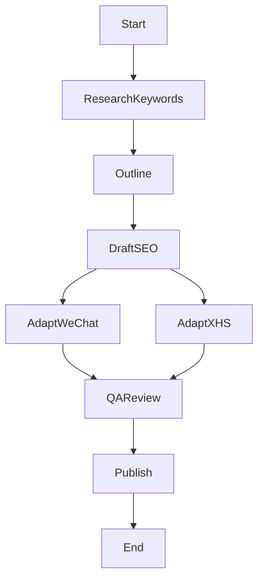

# LangGraph TypeScript 实战案例库（面向 Agent 应用市场与远程岗位）

本文件提供一组可落地的项目案例，面向 Agent 应用市场与远程工作岗位的真实需求。每个案例均包含业务痛点、目标用户、流程设计、LangGraph 结构要点、集成与评估指标，方便快速落地 MVP 并迭代商业化版本。

## 选题原则（适合应用市场）
- **清晰 ROI**：节省时间、减少人工错误、缩短响应周期。
- **可复制**：可参数化、模板化，适合多客户部署。
- **可控风险**：具备审核、权限、审计能力。
- **可扩展**：从单一部门扩展到跨团队协同。

---

## 案例 1：远程客服邮箱分流与升级代理

### 适用岗位
远程客服、客户成功（CS）

### 真实需求
每日大量邮箱，优先级混乱，无法及时识别紧急工单或账单问题。

### 核心能力
- 邮件分类（意图/紧急度/主题）
- 路由与升级（人工审核）
- 自动草拟回复

### LangGraph 设计要点
- Graph 模式：Router + HITL
- Nodes：ReadEmail → Classify → SearchDoc → DraftReply → HumanReview → Send
- State：emailContent, classification, searchResults, draftText, decision

### 集成建议
Gmail/Outlook API、Zendesk/Freshdesk、Slack 通知

### 成功指标
首响时间、升级准确率、自动回复命中率

---

## 案例 2：远程 SDR 线索预审与外呼前置代理

### 适用岗位
销售开发（SDR）

### 真实需求
线索质量参差，手工筛选浪费时间，错过高潜客。

### 核心能力
- 线索评分
- 公司/岗位信息补全
- 推荐外呼话术与优先级

### LangGraph 设计要点
- Graph 模式：Supervisor → Tools → Decision
- Nodes：EnrichLead → ScoreLead → DraftOutreach → Prioritize
- State：leadProfile, score, outreachDraft, priority

### 集成建议
LinkedIn、Clearbit、HubSpot/Salesforce、Slack

### 成功指标
高潜线索命中率、外呼准备时间、转化率提升

---

## 案例 3：远程招聘筛选与面试编排代理

### 适用岗位
招聘专员、HRBP

### 真实需求
简历筛选耗时，面试安排跨时区困难。

### 核心能力
- 简历解析与评分
- 结构化面试问题生成
- 日历与面试安排

### LangGraph 设计要点
- Graph 模式：分支路由 + Scheduling
- Nodes：ParseCV → ScoreFit → GenerateQuestions → ScheduleInterview
- State：candidateProfile, score, interviewPlan, schedule

### 集成建议
Google Calendar/Outlook、Lever/Greenhouse、Slack

### 成功指标
筛选用时、面试达成率、候选人满意度

---

## 案例 4：远程项目经理的周报与风险雷达

### 适用岗位
项目经理（PM）

### 真实需求
跨团队同步成本高，风险点难以及时发现。

### 核心能力
- 自动汇总周报
- 风险识别与提醒
- 进度追踪与阻塞分析

### LangGraph 设计要点
- Graph 模式：Subgraph 汇总 + 风险评估
- Nodes：CollectUpdates → Summarize → RiskDetect → Notify
- State：updates, summary, risks, actions

### 集成建议
Jira/Linear、Notion、Slack、GitHub

### 成功指标
周报生成时间、风险预警命中率

---

## 案例 5：远程财务应付/应收对账助手

### 适用岗位
财务、运营

### 真实需求
跨系统对账慢，容易漏账、错账。

### 核心能力
- 发票/订单/付款三方对账
- 异常识别与工单流转
- 自动生成对账报告

### LangGraph 设计要点
- Graph 模式：ETL → 校验 → 异常处理
- Nodes：LoadInvoices → MatchPayments → DetectAnomalies → GenerateReport
- State：invoices, payments, discrepancies, report

### 集成建议
ERP/财务系统、Stripe、QuickBooks

### 成功指标
对账时长、异常识别准确率

---

## 案例 6：远程工程团队的 Incident 分诊代理

### 适用岗位
SRE/DevOps/值班工程师

### 真实需求
告警噪声多，排障路径不清晰。

### 核心能力
- 告警分类与去重
- 关联历史事故与解决方案
- 自动生成处理建议与工单

### LangGraph 设计要点
- Graph 模式：Router + Retrieval + HITL
- Nodes：NormalizeAlert → Classify → RetrieveRunbook → ProposeAction → Escalate
- State：alert, class, runbook, action, approval

### 集成建议
PagerDuty、Datadog、Grafana、Jira

### 成功指标
MTTR、误报率、自动修复比例

---

## 案例 7：远程内容营销的多渠道素材工厂

### 适用岗位
内容运营、市场

### 真实需求
同一主题需多渠道复用，生产成本高。

### 核心能力
- 主题拆解与内容规划
- 多平台文案生成
- 复审与发布时间表

### LangGraph 设计要点
- Graph 模式：Plan → Write → Review → Schedule
- Nodes：PlanCampaign → DraftMultiChannel → HumanReview → PublishPlan
- State：topic, plan, drafts, approval, schedule

### 集成建议
Notion、Buffer/Hootsuite、Slack

### 成功指标
内容产出效率、发布准时率

---

## 案例 7A：SEO 营销文章与推广文案生成代理（含公众号/小红书）

说明：你提到可参考“宝玉”的营销文写作相关 skill，但当前可用技能列表中未包含该 skill，因此以下以通用营销写作方法论落地。若你提供该 skill 文件路径，我可按其风格改写模板与提示。

### 适用岗位
SEO 编辑、增长营销、内容运营

### 真实需求
SEO 文章、公众号推文、小红书种草文需要多版本创作，人工产出慢且难以保证转化结构。

### 核心能力
- SEO 文章大纲与标题生成
- 推广文案多版本输出（公众号/小红书/朋友圈/短视频口播）
- 关键词密度与可读性校验

### LangGraph 设计要点
- Graph 模式：Plan → Draft → Adapt → Review → Publish
- Nodes：ResearchKeywords → Outline → DraftSEO → AdaptWeChat → AdaptXHS → QAReview
- State：keywords, outline, seoDraft, wechatCopy, xhsCopy, qaReport

### 流程图（Mermaid）



### 集成建议
Notion/飞书文档、公众号后台、内容排期工具（如 Buffer）

### 成功指标
关键词排名提升、阅读/收藏率、转化率（点击/私信/加群）

### Prompt 模板（可直接用于节点）

**ResearchKeywords**

```text
你是 SEO 研究员。目标产品：{product}
受众：{audience}
核心卖点：{value_props}
请输出：
1) 核心关键词 5-8 个
2) 长尾关键词 8-12 个
3) 竞争角度与差异化要点 3-5 条
```

**Outline**

```text
你是内容策划。基于关键词与差异化要点，生成 SEO 文章大纲：
主题：{topic}
目标关键词：{keywords}
要求：
- 标题 5 个备选（含 1 个问句）
- H2/H3 结构清晰，逻辑为「痛点-方案-证据-行动」
```

**DraftSEO**

```text
你是 SEO 文案作者。根据大纲撰写 1200-1800 字中文文章。
要求：
- 首段 120 字内给出结论与价值
- 关键词自然分布，避免堆砌
- 结尾包含行动引导（私信/咨询/试用）
```

**AdaptWeChat**

```text
将 SEO 文章改写为微信公众号推文：
- 标题 1 个 + 备选 2 个
- 开头 80 字内抛出痛点/结论
- 3 个小标题分节，语气专业但亲和
- 结尾 CTA：关注/私信/领取资料
```

**AdaptXHS**

```text
将 SEO 文章改写为小红书种草风：
- 标题 1 个（不超过 20 字）
- 开头 50 字内强结果或对比
- 正文 6-10 条短段落，穿插 emoji（不过度）
- 结尾 1-2 个引导互动的问题
```

**QAReview**

```text
检查输出是否满足以下规则：
- 关键词覆盖与密度是否合理
- 是否出现夸大或不可证实表述
- CTA 清晰且不冒犯
输出：问题清单 + 修改建议
```

### 示例输出（摘要）

**公众号标题示例**
- 远程团队如何用 AI 把客服效率翻倍？
- 3 个步骤，让你的客服邮箱自动分流
- 从“手忙脚乱”到“稳准快”的客服升级方案

**小红书开头示例**
```
我们用 AI 让客服回复时间从 6 小时降到 30 分钟。
最关键的不是模型，而是工作流。
```

### SEO 校验规则（建议在 QAReview 中实现）
- 标题 20-30 字，含 1 个核心关键词
- 关键词密度 1.0% - 2.5%
- 内链 2-3 个（指向相关功能页/案例页）
- 段落不超过 5 行，H2 不少于 3 个

---

## 案例 8：远程产品团队的用户反馈聚类与路线图助手

### 适用岗位
产品经理、用户研究

### 真实需求
反馈分散，优先级难以量化。

### 核心能力
- 反馈聚类与标签
- 影响度评估
- 生成路线图建议

### LangGraph 设计要点
- Graph 模式：Batch + Ranking
- Nodes：IngestFeedback → Cluster → ScoreImpact → RecommendRoadmap
- State：feedback, clusters, scores, roadmap

### 集成建议
Zendesk、Canny、Notion/Jira

### 成功指标
反馈处理时长、路线图落地率

---

## 案例 9：远程法务合同初审与风险标注

### 适用岗位
法务、采购

### 真实需求
合同审阅耗时，关键条款遗漏风险高。

### 核心能力
- 合同条款抽取
- 风险条款标注与建议
- 审核流程与记录

### LangGraph 设计要点
- Graph 模式：Extract → Review → HITL → Archive
- Nodes：ParseContract → RiskIdentify → SuggestEdits → HumanApprove
- State：clauses, risks, suggestions, decision

### 集成建议
DocuSign、Google Drive、Slack

### 成功指标
审阅效率、风险命中率

---

## 案例 10：远程电商运营的异常监控与调价助手

### 适用岗位
电商运营、增长

### 真实需求
库存/价格波动频繁，手动响应慢。

### 核心能力
- 异常检测与原因分析
- 调价策略建议
- 执行前审核

### LangGraph 设计要点
- Graph 模式：Detect → Analyze → Propose → Approve
- Nodes：MonitorKPIs → Diagnose → PriceStrategy → HumanReview
- State：metrics, anomalies, strategy, approval

### 集成建议
Shopify、Google Analytics、Slack

### 成功指标
异常响应时间、利润提升幅度

---

## 案例 11：远程客户培训与入职指导助手

### 适用岗位
客户成功、实施顾问

### 真实需求
新客户 onboarding 成本高，重复答疑多。

### 核心能力
- 入职路径生成
- 自适应 FAQ 与教程
- 进度追踪与提醒

### LangGraph 设计要点
- Graph 模式：Adaptive Path + Memory
- Nodes：AssessUser → GeneratePlan → Teach → CheckProgress
- State：userProfile, onboardingPlan, progress

### 集成建议
LMS、Slack、Notion

### 成功指标
上手时间、培训完成率

---

## 案例 12：远程数据分析自助助手（多表查询）

### 适用岗位
数据分析、业务运营

### 真实需求
业务人员不会写 SQL，分析需求多而零散。

### 核心能力
- 语义查询转 SQL
- 多表 join 建议
- 结果解释与可视化建议

### LangGraph 设计要点
- Graph 模式：Planner → SQL → Validate → Explain
- Nodes：ParseQuestion → GenerateSQL → ValidateSQL → SummarizeResult
- State：question, sql, validation, result, explanation

### 集成建议
BigQuery/Snowflake、Metabase

### 成功指标
分析响应时间、查询准确率

---

## 快速落地建议（MVP）

1. **先做单一流程闭环**：输入 → 处理 → 输出 → 人工审核。
2. **先覆盖高频需求**：如客服分流、线索预审、周报汇总。
3. **先用轻量集成**：Webhook + Slack/Email 即可上线内测。
4. **先定义 KPI**：例如节省时间、减少错误、提升转化。

---

## 应用市场包装建议

- **模板化配置**：行业/公司/语气/规则参数化。
- **展示真实 ROI**：节省工时、响应提速。
- **安全与合规**：权限、日志、审核。
- **可扩展插件**：CRM、客服、日历、文档系统。
