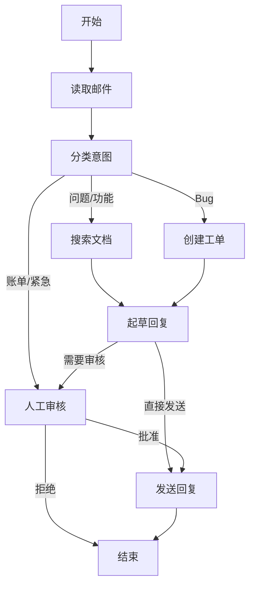

## 产品要求

邮件代理应该能够：

- 读取客户邮件
- 按紧急程度和主题分类
- 搜索相关文档来回答问题
- 起草适当的回复
- 将复杂问题升级给人工代理
- 必要时安排后续跟进

需要处理的场景示例：

1. 简单产品问题："如何重置密码？"
2. Bug 报告："选择 PDF 格式时导出功能崩溃"
3. 紧急账单问题："我的订阅被扣了两次！"
4. 功能请求："能在移动应用中添加暗色模式吗？"
5. 复杂技术问题："我们的 API 集成间歇性失败，出现 504 错误"

## 工作流程



### 流程步骤

1. **Read Email** - 提取并解析电子邮件内容
2. **Classify Intent** - 使用 LLM 对紧急程度和主题进行分类，然后路由到相应的行动
3. **Doc Search** - 查询知识库以获取相关信息
4. **Bug Track** - 在跟踪系统中创建或更新问题
5. **Draft Reply** - 生成适当的回应
6. **Human Review** - 上报人工处理或审批
7. **Send Reply** - 发送邮件回复

## LangGraph 核心概念

### 1. 节点（Nodes）

节点是工作流程中的离散步骤，每种节点负责特定任务：

- **LLM 节点**：使用语言模型进行决策或生成内容
- **数据节点**：获取或转换数据
- **行动节点**：执行外部操作（如发送邮件）
- **用户输入节点**：暂停等待人工反馈

### 2. 状态（State）

状态是一个中心对象，所有节点都从中读取数据并更新它。

**关键原则**：保持状态原始，按需格式化提示

- 存储原始数据（如搜索结果数组），而不是格式化文本
- 在需要时动态构建提示，避免在状态中存储格式化内容
- 这样可以保持灵活性，便于后续修改

### 3. 条件路由（Conditional Routing）

使用 `Command` 实现基于状态的条件路由：

```typescript
return new Command({
  update: { classification },
  goto: nextNode,  // 根据分类结果路由到不同节点
});
```

### 4. 人工交互（Human Interaction）

使用 `interrupt` 实现人工审核暂停点：

```typescript
const humanDecision = interrupt({
  emailId: state.emailId,
  draftResponse: state.responseText,
  action: "Please review and approve/edit this response",
});

// 等待人工输入后继续执行
if (humanDecision.approved) {
  return new Command({ goto: "sendReply" });
}
```

### 5. 持久化（Persistence）

使用 `MemorySaver` 实现状态持久化：

```typescript
const memory = new MemorySaver();
const app = workflow.compile({ checkpointer: memory });

// 使用 thread_id 保存和恢复状态
const config = { configurable: { thread_id: "customer_123" } };
```

## 实现细节

### 状态定义

使用 `StateSchema` 和 Zod 定义类型安全的状态：

```typescript
const EmailClassificationSchema = z.object({
  intent: z.enum(["question", "bug", "billing", "feature", "complex"]),
  urgency: z.enum(["low", "medium", "high", "critical"]),
  topic: z.string(),
  summary: z.string(),
});

const EmailAgentState = new StateSchema({
  emailContent: z.string(),
  senderEmail: z.string(),
  emailId: z.string(),
  classification: EmailClassificationSchema.optional(),
  searchResults: z.array(z.string()).optional(),
  customerHistory: z.record(z.string(), z.any()).optional(),
  responseText: z.string().optional(),
});
```

### 结构化输出

使用 `withStructuredOutput` 让 LLM 返回结构化数据：

```typescript
const structuredLlm = llm.withStructuredOutput(EmailClassificationSchema);
const classification = await structuredLlm.invoke(classificationPrompt);
```

### 错误处理

在节点中明确处理错误，区分可恢复和不可恢复错误：

```typescript
try {
  searchResults = await searchService.query(query);
} catch (error) {
  searchResults = [`Search temporarily unavailable: ${error}`];
}
```

## 运行示例

```bash
# 安装依赖
pnpm install

# 运行示例
pnpm run 02-email-agent
```

示例会处理一个紧急账单问题邮件，流程如下：

1. 读取邮件内容
2. LLM 分类为"账单"意图，"紧急"级别
3. 路由到人工审核节点
4. 暂停等待人工审批
5. 人工批准后发送回复

## 关键要点

- **模块化设计**：每个节点专注单一职责
- **状态最小化**：只存储必要数据，按需格式化
- **显式路由**：使用 `Command` 明确定义节点转换
- **可观测性**：清晰的节点边界便于调试和监控
- **可测试性**：每个节点可独立测试
- **持久化支持**：通过 `MemorySaver` 实现长时间运行的工作流
